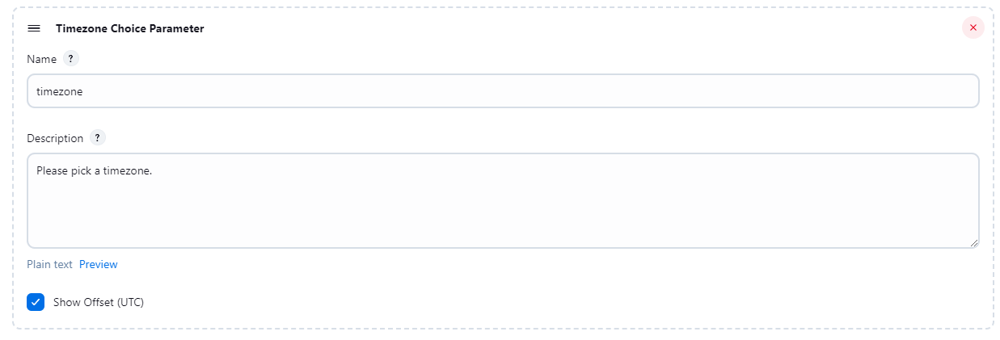
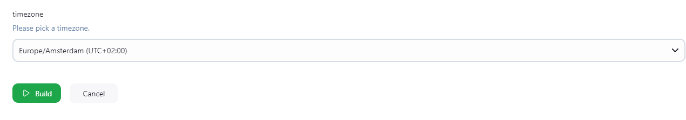

# Jenkins Timezone Parameter Plugin

This plugin allows Jenkins users to add a **Timezone Choice Parameter** to their jobs. It provides a dropdown list of timezones, with the option to display UTC offsets. Users can select a timezone to pass as a parameter to their pipeline jobs.

## Features

- **Simple Timezone Dropdown**: Adds a list of timezones that users can choose from.
- **Calculate Offset**: Optionally display timezones with their corresponding UTC offsets.

## Installation

1. Clone the repository.
2. Build the plugin using Apache Maven.  `mvn clean package`
3. After the build completes, locate the `.hpi` file in the target folder.
4. Open Jenkins and navigate to **Manage Jenkins** → **Manage Plugins** → **Advanced** → **Upload Plugin**.
5. Upload the `.hpi` file and restart Jenkins to activate the plugin.

## Usage

### Job Configuration
When configuring a job, you can add the **Timezone Choice Parameter** by selecting it from the **Add Parameter** dropdown. You can choose to disable **Calculate Offset**.

### Build with Parameters
When you run the job with parameters, you'll see the timezone options, including any offsets if the **Calculate Offset** option was selected.

### Prerequisites
- Java 11 or higher
- Apache Maven
- Jenkins 2.235.1 or higher

## Contributing

Contributions are welcome! If you find any issues or have suggestions for improvements, feel free to create a pull request or open an issue.

1. Fork the repository.
2. Create a new branch.
3. Make your changes.
4. Push to your branch.
5. Open a pull request.

## License

Licensed under MIT, see [LICENSE](LICENSE.md)
